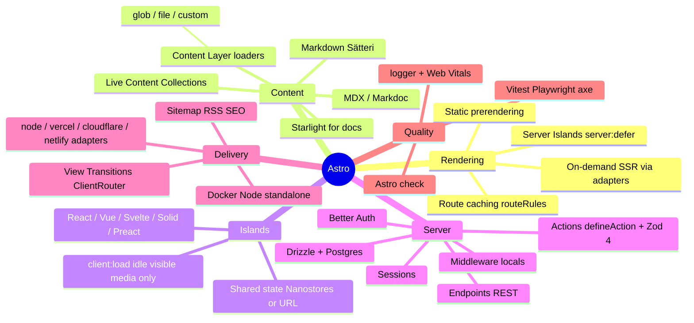

# The Astro Architecture Course

> **Build as much as possible with HTML, CSS, Astro, and the web platform. Add JavaScript only where it provides real value.**
>
> A production-grade course on **content-first development**, **islands architecture**, and **full-stack Astro** — not "React with `.astro` files."

**Course context:** September 2026 · **Verified against:** official Astro documentation (`docs.astro.build`), Astro v6/v7 upgrade guides, and the official changelog · **Target framework version:** Astro **7.3.x** (current stable at time of writing)

---

## How to Use This Course

This repository is the course. It is designed to be worked through **module by module**, in order. Do not skip the orientation: every module assumes the mental models established there.

| Path | What it is |
|---|---|
| [`course/00-orientation/`](course/00-orientation/) | Philosophy, prerequisites, the **verified stack**, and Astro's version evolution |
| [`course/modules/`](course/modules/) | 40 modules. Each includes: concept & architecture, code examples, common mistakes (BAD/GOOD), security notes, performance notes, five exercise tiers (Beginner / Intermediate / Production / Architecture Challenge / Debugging Challenge), a mental model, official docs links, and a "What I Should Know Before Continuing" check |
| [`course/projects/`](course/projects/) | Three progressive projects + the capstone PRD |
| [`course/reference/`](course/reference/) | Decision matrix, request-flow / sequence diagrams, security checklist |

**Rule of engagement:** every module ends with exercises (Beginner / Intermediate / Production / Architecture Challenge / Debugging Challenge). Do them. The goal is not "I know Astro syntax" — it is **"I know exactly where HTML, CSS, server code, and client JavaScript belong."**

---

## 1. Course Philosophy

Astro's philosophy is inverted from the SPA era:

```
HTML first → CSS second → Astro third → JavaScript when necessary → client framework only when necessary
```

A traditional SPA answers every question with client JavaScript. This course trains you to answer first with the **web platform** (HTML semantics, forms, links, URLs, CSS), then with **Astro's server-first rendering**, and only then with JavaScript — at the smallest possible scope: a single **island**.

You will repeatedly practice the same discipline:

1. **Content-first** — model the content and the URLs before the components.
2. **Ship HTML, not a framework runtime** — most of a page is not interactive.
3. **Pay JavaScript per interaction** — every hydrated island is a cost you consciously accept.
4. **Server for secrets and authority** — validation, auth, authorization, and mutations belong on the server.
5. **Progressive enhancement** — the page works without JS; islands make it delightful with JS.

## 2. Who Should Learn Astro

- Frontend developers who want to build **content-heavy production sites** (blogs, docs, marketing, editorial, portfolios).
- React/Vue/Svelte developers who want to understand **where their framework actually belongs**.
- Full-stack TypeScript engineers building **SaaS marketing sites + authenticated portals**.
- Engineers who care about **Core Web Vitals, SEO, accessibility, and security** as architecture concerns, not afterthoughts.
- Technical leads who must decide **"Astro or something else?"** honestly.

**Not ideal as a first course ever:** you should be comfortable with HTML/CSS/JS/TypeScript basics and git. (See prerequisites.)

## 3. Prerequisites

| Area | You should already know |
|---|---|
| HTML | Semantic elements, forms, links, metadata |
| CSS | Selectors, box model, flexbox/grid basics, media queries |
| JavaScript/TypeScript | ES modules, async/await, fetch, basic types |
| Tooling | npm/pnpm, git, terminal basics |
| Helpful, not required | React (Module 09 compares it explicitly), REST/HTTP, SQL concepts |

Setup specifics (Node version, editor, CLI) are in [`course/00-orientation/02-prerequisites-and-setup.md`](course/00-orientation/02-prerequisites-and-setup.md).

## 4. Learning Outcomes

By the end of this course you can independently and correctly decide:

- Should this be an **Astro component** or an **interactive island**?
- Should this execute on the **server** or in the **browser**?
- Should this page be **prerendered** or **server-rendered**?
- Do I need JavaScript at all? Could **native HTML/CSS** handle it?
- Should this interaction use **browser APIs** instead of a framework?
- Should this use **Astro Actions**, a **server endpoint**, or a plain **HTML form**?
- Should this state live in the **URL**, the **server**, or a **client store**?
- Is a **client-side framework** justified here — and if so, which one and how big?
- How do I keep **auth, authorization, tenancy, performance, SEO, and a11y** correct while doing all of the above?

## 5. Current Astro Status (September 2026)

Verified from official sources ([Upgrade Astro](https://docs.astro.build/en/upgrade-astro/), [v6 upgrade guide](https://docs.astro.build/en/guides/upgrade-to/v6/), [v7 upgrade guide](https://docs.astro.build/en/guides/upgrade-to/v7/), [changelog](https://github.com/withastro/astro/blob/main/packages/astro/CHANGELOG.md)):

- **Current stable: Astro 7.3.x.** Astro 7.0 shipped **22 June 2026**. Astro 6.0 shipped **February 2026**.
- **Ownership:** Cloudflare acquired The Astro Technology Company in **January 2026**. Astro remains **MIT-licensed open source**; the core team joined Cloudflare. Expect the Cloudflare adapter/runtime story to keep evolving.
- **Astro 6 headlines:** rebuilt dev server on **Vite's Environment API**, **Zod 4**, **Node ≥ 22.12**, legacy content collections **removed** (Content Layer only), `Astro.glob()` removed, **Live Content Collections** and **CSP** stable, `import.meta.env` **always inlined at build time** (use `process.env` for runtime server config).
- **Astro 7 headlines:** **Vite 8** (Rolldown), **Rust compiler** (default and only), native **Sätteri** Markdown pipeline (remark/rehype now opt-in via `@astrojs/markdown-remark`), **route caching** stable (`cache` / `routeRules` / `Astro.cache`), **advanced routing** (`src/fetch.ts`), stable structured `logger`, `compressHTML: 'jsx'` whitespace default, **`@astrojs/db` removed** (use Drizzle / `node:sqlite` / Turso / Neon / PlanetScale).

**Stability legend used throughout the course:**

| Label | Meaning |
|---|---|
| ✅ **Stable** | Documented, production-ready. Safe as a foundation. |
| 🧪 **Experimental** | Behind a flag or newly released. Verify the flag list in the [configuration reference](https://docs.astro.build/en/reference/configuration-reference/) before relying on it. Never the default course foundation. |
| ⛔ **Deprecated / Removed** | Old API. Taught only as "OLD vs MODERN" so you can recognize legacy tutorials. |

## 6. Verified Technology Stack

The full annotated stack lives in [`course/00-orientation/03-current-verified-stack.md`](course/00-orientation/03-current-verified-stack.md). Summary:

| Layer | Choice | Status (Sep 2026) |
|---|---|---|
| Framework | **Astro 7.3.x** | ✅ |
| Runtime | **Node.js 24 LTS** (min 22.12+) | ✅ |
| Language | **TypeScript 5.x** | ✅ |
| Bundler/dev server | **Vite 8** (Rolldown), Environment API | ✅ |
| Compiler | Rust-based Astro compiler | ✅ (default & only in v7) |
| Primary UI framework | **React 19** via `@astrojs/react` — **islands only** | ✅ |
| Other frameworks | Vue, Svelte, Solid, Preact, (Lit) integrations | ✅ (use sparingly) |
| Styling | **Tailwind CSS 4** via `@tailwindcss/vite` + scoped CSS | ✅ |
| Validation | **Zod 4** via `astro/zod` | ✅ (`astro:schema` ⛔) |
| Auth | **Better Auth** (official docs' lead recommendation; Clerk as hosted alt) | ✅ (Lucia is now a learning resource, not a library ⛔) |
| Database | **PostgreSQL** + **Drizzle ORM** (alt: Neon, Turso, `node:sqlite`) | ✅ (`@astrojs/db` ⛔ removed in v7) |
| Content | **Content Layer** (`src/content.config.ts`, `glob()`/`file()`/custom loaders) | ✅ (legacy collections ⛔) |
| Live data content | **Live Content Collections** (`src/live.config.ts`) | ✅ (stable since v6) |
| Markdown / MDX | **Sätteri** pipeline default; `@astrojs/mdx`; `@astrojs/markdown-remark` for unified plugins | ✅ |
| Sessions | **Astro Sessions** (`Astro.session` / `context.session`) | ✅ |
| Server islands | `server:defer` | ✅ |
| Route caching | `cache` provider + `routeRules` + `Astro.cache.set()` | ✅ new in v7 |
| Testing | **Vitest** + Testing Library + **Playwright** + axe-core | ✅ |
| Adapters | `@astrojs/node`, `@astrojs/vercel`, `@astrojs/cloudflare`, `@astrojs/netlify` | ✅ |
| Images | `astro:assets` (`<Image>`, `<Picture>`, SVG components, responsive `layout`) | ✅ |
| SEO tooling | `@astrojs/sitemap`, `@astrojs/rss`, JSON-LD by hand | ✅ |

## 7. Ecosystem Map



**Ecosystem rules taught in this course:**

1. Prefer **official** integrations and docs over blog posts and videos (many still teach removed APIs).
2. One primary UI framework per project (React here) — mixing frameworks is an explicit, justified decision, not a default.
3. The Content Layer is Astro's superpower; treat third-party loaders (CMS, databases) as first-class content sources.
4. `npx @astrojs/upgrade` keeps Astro + official integrations in sync.

## 8. Astro Mental Model

**Traditional SPA:**

```
Browser → downloads JS → boots framework → framework renders UI → (maybe) fetches data
```

**Astro:**

```
Request → Astro (server/build) → HTML → Browser renders immediately
                                       → only interactive islands hydrate, where needed
```

Astro components **run at render time (build or server) and disappear**. What the browser receives is HTML + CSS + only the JavaScript you explicitly opted into. This is the single most important idea in the course. Full treatment: [Module 01](course/modules/01-astro-mental-model.md).

```
            ASTRO PAGE
                │
     ┌──────────┼──────────┐
     │          │          │
  Content     HTML      Layout
     │          │          │
     └──────────┼──────────┘
                │
        Static / SSR HTML
                │
             Browser
                │
      ┌─────────┼─────────┐
      │         │         │
    No JS   Island A   Island B
                │         │
             React     React/Vue
                       /Svelte/Solid
```

## 9. Islands Architecture

An **island** is an enhanced, independently rendered UI component in a sea of static HTML. Two kinds:

- **Client island** — a UI-framework component that hydrates separately (`client:*` directive).
- **Server island** — a component whose server rendering is deferred out of the page's main render (`server:defer`).

Why: most pages are documents. Hydrating an entire application pays JS cost for content that never changes. Islands make JavaScript a **per-component, per-need decision**. Multiple islands coexist, each with its own framework, bundle, and lifecycle; static Astro components around them ship zero JS. Deep dive: [Module 07](course/modules/07-islands-architecture.md), directives: [Module 08](course/modules/08-client-directives.md).

## 10. Server / Client Boundary

| Question | Server (Astro frontmatter, Actions, endpoints, middleware) | Browser (islands, `<script>`, browser APIs) |
|---|---|---|
| Secrets / API keys | ✅ never leave | ⛔ never put here |
| Authorization decisions | ✅ always enforced here | ⛔ UI hints only |
| Content rendering | ✅ | only if interactive |
| Input validation | ✅ authoritative (Zod) | optional UX nicety |
| Interaction state | URL/session/DB | island-local state |
| Animations, focus, media queries | — | ✅ |

Server code runs at **build time** (prerendered pages) or **request time** (SSR). Client code runs only if you ship it. The boundary is enforced by tooling: anything imported into an island can end up in the browser bundle. See [Modules 07, 16, 23](course/modules/07-islands-architecture.md).

## 11. Rendering Model

Astro v5+ has **two output modes** (the old `hybrid` mode is gone ⛔):

| Mode | Default per page | Opt-out per page | Use |
|---|---|---|---|
| `output: 'static'` (default) | `prerender = true` | `export const prerender = false` → on-demand (needs adapter) | content sites, marketing, docs |
| `output: 'server'` | `prerender = false` | `export const prerender = true` → static | app-like, auth-heavy, per-request data |

Every page earns its rendering mode by asking: *Does this need runtime data? Cookies? Authenticated users? Change frequently?* — [Module 14](course/modules/14-ssr-adapters-and-rendering-strategy.md). Static pages flow to a CDN; SSR pages flow through the adapter runtime. Both are first-class.

## 12. Complete Course Roadmap

Four phases, 40 modules. (Ordered pedagogically; the original 30-phase sketch is mapped inside each module header.)

**PHASE A — Mental Model & Fundamentals** ([modules 01–06](course/modules/))
1. [Astro Mental Model](course/modules/01-astro-mental-model.md) · 2. [Project Setup & Toolchain](course/modules/02-project-setup-and-toolchain.md) · 3. [Astro Components](course/modules/03-astro-components.md) · 4. [Props, Slots & Composition](course/modules/04-props-slots-and-composition.md) · 5. [Pages, Layouts & Routing](course/modules/05-pages-layouts-and-routing.md) · 6. [Styling, CSS & Design Systems](course/modules/06-styling-css-and-design-systems.md)

**PHASE B — Islands & Content** ([modules 07–12](course/modules/))
7. [Islands Architecture](course/modules/07-islands-architecture.md) · 8. [Client Directives](course/modules/08-client-directives.md) · 9. [Framework Interop & React Islands](course/modules/09-framework-interop-and-react-islands.md) · 10. [Content Layer & Collections](course/modules/10-content-layer-and-collections.md) · 11. [Markdown & MDX](course/modules/11-markdown-and-mdx.md) · 12. [Content Modeling](course/modules/12-content-modeling.md)

**PHASE C — The Server** ([modules 13–24](course/modules/))
13. [Static Generation](course/modules/13-static-generation.md) · 14. [SSR, Adapters & Rendering Strategy](course/modules/14-ssr-adapters-and-rendering-strategy.md) · 15. [Server Endpoints](course/modules/15-server-endpoints.md) · 16. [Astro Actions](course/modules/16-astro-actions.md) · 17. [Forms & Progressive Enhancement](course/modules/17-forms-and-progressive-enhancement.md) · 18. [Middleware](course/modules/18-middleware.md) · 19. [Database & Server Architecture](course/modules/19-database-and-server-architecture.md) · 20. [Data Fetching & API Design](course/modules/20-data-fetching-and-api-design.md) · 21. [Authentication](course/modules/21-authentication.md) · 22. [Authorization & Multi-Tenancy](course/modules/22-authorization-and-multi-tenancy.md) · 23. [Security](course/modules/23-security.md) · 24. [State Management & Client Data](course/modules/24-state-management-and-client-data.md)

**PHASE D — Quality, Delivery & Judgment** ([modules 25–40](course/modules/))
25. [Images & Media](course/modules/25-images-and-media.md) · 26. [SEO, Sitemaps & Feeds](course/modules/26-seo-sitemaps-and-feeds.md) · 27. [View Transitions & Animation](course/modules/27-view-transitions-and-animation.md) · 28. [Accessibility](course/modules/28-accessibility.md) · 29. [Performance](course/modules/29-performance.md) · 30. [Testing](course/modules/30-testing.md) · 31. [Observability & Analytics](course/modules/31-observability-and-analytics.md) · 32. [Integrations & Vite](course/modules/32-integrations-and-vite.md) · 33. [Environment Variables & Config](course/modules/33-environment-variables-and-configuration.md) · 34. [Caching & Revalidation](course/modules/34-caching-and-revalidation.md) · 35. [Search & Internationalization](course/modules/35-search-and-i18n.md) · 36. [File Uploads, Email & Webhooks](course/modules/36-file-uploads-email-and-webhooks.md) · 37. [Deployment & Runtimes](course/modules/37-deployment-and-runtimes.md) · 38. [Debugging Training](course/modules/38-debugging-training.md) · 39. [Anti-Patterns & When Not to Use Astro](course/modules/39-anti-patterns-and-when-not-to-use-astro.md) · 40. [Astro vs Next.js vs TanStack Start](course/modules/40-astro-vs-nextjs-vs-tanstack-start.md)

## 13. Project Roadmap

| Project | You build | You learn |
|---|---|---|
| [Project 1](course/projects/project-1-content-first-blog.md) | Content-first blog | components, layouts, routing, Content Layer, Markdown/MDX, SEO, RSS, sitemap |
| [Project 2](course/projects/project-2-interactive-marketing-site.md) | Interactive marketing site | islands, React, client directives, forms, animation, view transitions |
| [Project 3](course/projects/project-3-fullstack-saas.md) | Full-stack SaaS | SSR, auth, authorization, Actions, middleware, database, uploads, admin, testing, deployment |
| [Capstone](course/projects/capstone-prd-and-architecture.md) | "Modern SaaS + Docs + Content Platform" | everything, architected deliberately — **PRD first, you design, then review** |

## 14. Capstone Architecture

A preview (full treatment in the [capstone document](course/projects/capstone-prd-and-architecture.md)):

```text
src/
  components/          # Astro components — zero-JS building blocks
    react/             # ONLY interactive islands live here
  layouts/             # shell: head, nav, footer, ClientRouter decision
  pages/               # routing = file system; mixed static + SSR routes
  content/             # Markdown/MDX + data files (Content Layer)
  content.config.ts    # schema + loaders — content is typed data
  live.config.ts       # live collections for request-time data sources
  actions/             # type-safe mutations (forms + client calls)
  middleware.ts        # request pipeline: session → locals → authz context
  server/
    auth/ db/ services/ repositories/ permissions/
  styles/ utils/
```

Every folder has a *reason*; the course teaches which folders you can delete for a given project.

## 15. Performance Strategy

Performance is architecture, measured not hoped:

- **JavaScript budget:** per-island budgets (e.g. hydrated JS ≤ 50 KB gzip per island, ≤ 100 KB total page JS for content pages). Decide budgets *before* coding.
- **Hydration cost:** `client:load` only for above-the-fold critical interactivity; `idle`/`visible`/`media` elsewhere; zero JS for the rest.
- **Images & fonts:** `astro:assets`, responsive `layout`, self-hosted/subset fonts, `font-display`.
- **Web Vitals:** LCP (server TTFB + hero image), CLS (dimensions + fallbacks), INP (island size & work).
- **Caching:** static HTML at CDN, v7 route caching (`routeRules`, `maxAge`, `swr`, tags) for SSR.
- **Compare implementations:** Module 32 ships the "Heavy SPA vs Astro islands" case study with measurement methodology.

## 16. Authentication Architecture

Astro has **no single official auth system** — by design. Verified current guidance ([Authentication docs](https://docs.astro.build/en/guides/authentication/)): use an auth library (**Better Auth** — framework-agnostic, first-class Astro support — or hosted providers like **Clerk**; **Lucia is now a learning resource, not a maintained library** ⛔).

**Course architecture (Module 21):** session-cookie-based auth with **Better Auth** mounted on an endpoint + `context.locals.user/session` populated in **middleware**, with authorization **re-checked at every Action/service** (middleware is convenience, not the security boundary). Concepts taught independently of any library: sessions, `HttpOnly`/`Secure`/`SameSite`, CSRF, rotation, revocation, OAuth, reset/verification flows, MFA.

## 17. Deployment Architecture

```
BUILD (astro build) → OUTPUT (static/ + server/) → ADAPTER (node|vercel|cloudflare|netlify) → RUNTIME
```

- **Static hosting** — HTML/CSS/JS to any CDN. No Actions, sessions, SSR, or server endpoints at runtime.
- **Node** — `@astrojs/node` `standalone` or `middleware` mode; Docker-friendly (Module 37 ships the Dockerfile).
- **Vercel / Netlify / Cloudflare** — official adapters, each with its own runtime constraints (Cloudflare: Workers runtime, driver-choices for sessions/DB).
- **Edge vs Node** — APIs, DB drivers, latency, and cold starts differ; choose per route, not per religion.

## 18. Astro vs Next.js vs TanStack Start

Short version (full matrix in [Module 40](course/modules/40-astro-vs-nextjs-vs-tanstack-start.md)):

| | Astro | Next.js | TanStack Start |
|---|---|---|---|
| Core metaphor | Content + selective islands | Full-stack React | Full-stack React + TanStack routing |
| Default JS shipped | ~0 | React runtime + router | React runtime + router |
| Content (MD/MDX, collections) | First-class | Good (MDX), via conventions | DIY / via libraries |
| Rich client UIs | Via islands (deliberate) | Native strength | Native strength |
| Server mutations | Actions / endpoints | Server Actions / route handlers | server functions |
| Best when | content-heavy, SEO, mixed static/dynamic | app-like React product | SPA-feeling app with server needs |

No winner is declared. The course teaches **when each architecture makes sense** — and Module 39 covers **when not to use Astro**.

---

## Course Standards

Every module is written to survive review by an Astro core contributor, a performance/SEO/accessibility/security engineer, and a staff engineer. Deprecated APIs are labeled ⛔ and shown as **OLD vs MODERN**. Experimental features are labeled 🧪 and never become the foundation. Where official documentation could not confirm a detail, the course says so and teaches you how to verify it yourself (see [orientation 04](course/00-orientation/04-ecosystem-map-and-astro-evolution.md)).

**Start here →** [`course/00-orientation/01-course-philosophy.md`](course/00-orientation/01-course-philosophy.md)
