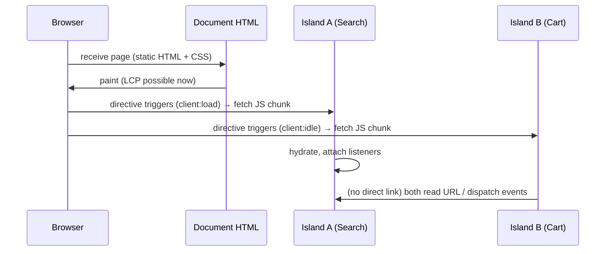

# Module 07 — Islands Architecture (Deep Dive)

> Phase 6. **The most important Astro concept.** If you internalize one module, make it this one.

## Concept: what is an island?

An **island** is an independently rendered, independently hydrated UI component on an otherwise static page of HTML. Astro has two species:

| | **Client island** | **Server island** |
|---|---|---|
| What it is | interactive JS component hydrated in the browser | server-rendered component deferred out of the page's main render |
| Directive | `client:load/idle/visible/media/only` | `server:defer` |
| Cost | framework JS + hydration | one extra request at runtime |
| Renders where | server (usually) + browser | server (on demand) |
| For | interaction | dynamic/personalized fragments (avatar, price, cart badge) |

Coined pattern history: "islands architecture" (pre-Astro, Svelte/Urdu etc.) — Astro made it the default rendering model.

## Why islands exist

**The problem with hydrating everything:** a content page (blog post, docs, marketing) is ~95% static. An SPA framework still ships its runtime, router, and component tree to make a `<p>` clickable-less. Cost: KB downloaded, MB-seconds of parse/execute, hydration blocking INP, and — often worse — accessibility regressions from div-based components replacing real HTML.

**The island answer:** pay JS **per interaction**, not per page. Static HTML stays the baseline; enhancement is local and optional.

## What hydrates vs what doesn't

```text
PAGE
├── Header            ── Astro ──► static HTML, 0 JS
├── Hero              ── Astro ──► static HTML, 0 JS
├── Blog content      ── Astro/MDX ──► static HTML, 0 JS
├── Search            ── React island (client:load) ──► JS + hydration
├── Cart badge        ── server island (server:defer) ──► deferred HTML
├── Newsletter form   ── Astro + <form> ──► 0 JS (works without JS!)
└── Comments          ── React island (client:visible) ──► JS on scroll
```

**Hydration** = taking server-rendered DOM and attaching the framework's event system/state to it, without re-creating the markup (when SSR HTML matches). Non-island HTML is **never** hydrated — no listeners, no vdom, no cost.

## How multiple islands coexist

Each island:
- has its **own** bundle chunk + shares the framework chunk (two React islands = one React download),
- hydrates on **its own schedule** (directive),
- has its **own** state and lifecycle,
- knows **nothing** about sibling islands.



## Communication & shared state (the honest options)

| Mechanism | When | Cost |
|---|---|---|
| **URL (query/hash/path)** | filterable/searchable/shareable state | free — the platform's store |
| **DOM events** (`CustomEvent`) | loose coupling, one-shot signals | ~free |
| **Shared vanilla module** | tiny shared store (both islands import same TS module) | one module |
| **Nanostores / Zustand** | several islands, frequent shared updates | small lib |
| **Server (Actions/session/DB)** | authoritative data (user, cart) | request latency |
| **Props from Astro page** | static config into islands | serializable values only |

Rule (Module 24 expands): **state has an owner.** URL owns shareable state; server owns authoritative state; islands own local UI state. Global client stores are the *last* resort.

## Server islands, specifically

```astro
---
// The page renders NOW; the avatar renders when its data is ready.
import Avatar from '../components/Avatar.astro';
import PromoPrice from '../components/PromoPrice.astro';
---
<header>
  <h1>Dashboard</h1>
  <!-- SSR fragment deferred: fallback shown first, fetched after page load -->
  <Avatar server:defer>
    <span slot="fallback" class="skeleton">…</span>
  </Avatar>
</header>
<PromoPrice server:defer />
```

Under the hood: at build/serve, the component is replaced by a tiny script + fallback; the runtime renders the component's own route and swaps the HTML in. Works with cookies/auth (it's real SSR) — **but the request carrying the island's data is a normal request: protect it like any other** (it inherits the user's cookies — fine — but never render secrets into it that the main page wouldn't show).

Constraints (verified): props must be **serializable** (no functions, no circular objects); requires an adapter.

## Why this beats "SPA inside Astro"

A SPA-in-Astro (`client:load` on the root `App`) reproduces every SPA cost: full runtime, client router, blank-screen boot, hydration blocking — while paying *extra* complexity for the Astro wrapper. If you truly need an SPA, use a framework's native full-stack meta-framework honestly (Module 40). Islands are for **pages** that need **widgets**.

## Common Mistakes

**BAD:** `<Header client:load />` "because it has a mobile menu."

**GOOD:** the menu is `<details>`/`<button>` + a 30-line bundled script — 0 framework JS.

**BAD:** five islands each with their own `useState` for `theme` and out-of-sync UI.

**GOOD:** theme in `html[data-theme]` (DOM is the shared state); islands read it.

**BAD:** `client:load` on a 60 KB chart below the fold.

**GOOD:** `client:visible` (Module 08) — or a prerendered ``/inline SVG chart.

**BAD:** hydrating a component that renders identical output to its static version "for consistency."

**GOOD:** render it as an Astro component; extract only the interactive control as an island.

**BAD:** passing functions/instances as island props.

**GOOD:** serializable props; signals via events or URLs.

## Security Notes

- Island code is public — anything imported there ships to the browser (env vars with `PUBLIC_`, internal URLs, algos).
- Server islands return HTML over a request: treat as private data channel only over HTTPS with same-origin cookies; add CSRF protections for state-changing follow-ups (Module 23).
- Isolated islands reduce XSS blast radius: a compromised island widget can't rewrite the document's server-rendered content on first paint.

## Performance Notes

- **Budget model:** every island pays (1) bytes of its chunk + shared framework, (2) hydration CPU, (3) long-task risk on low-end devices. Track per-page totals (Module 29).
- Directives are the throttle: `load` > `idle` > `visible` > `media` > `only` (Module 08).
- Hydration cost ≠ download cost. A 10 KB island with heavy render logic can hurt INP more than a 30 KB leaf component.
- Measure with Lighthouse/WebPageTest **and** real-user Web Vitals.

## Exercises

**Beginner.** Take a static page; convert exactly one interactive widget to a React island (`client:idle`). Record before/after JS bytes (Network tab) and write them down.

**Intermediate.** Two islands (Search + Cart badge) sharing state via URL query (`?q=`). Both update on `astro:page-load` (for ClientRouter compatibility) and via `popstate`. No state library.

**Production.** Add `<Avatar server:defer>` with skeleton fallback to an SSR page; verify (View Source) the fallback HTML + tiny script and the delayed swap in the network waterfall.

**Architecture Challenge.** A docs page has: sidebar nav, search, code examples, live preview, newsletter, comments. Assign each: Astro / island / directive / state owner. Write the JS budget estimate.

> **Review:** sidebar nav = Astro + CSS (or tiny script); search = island (`client:load` if keyboard-first, else `idle`), state in URL `?q=`; code examples = Astro + copy script (delegated); live preview = island `client:visible` (heavy); newsletter = native form + Action (0 JS baseline, island optional for UX); comments = island `client:visible` or SSR embed. Budget: search ~8–20 KB + React shared, preview 30–60 KB deferred, rest ~0.

**Debugging Challenge.** An island works in dev but never hydrates in prod build. You wrote `<SearchBox client:load>` but imported it via a **dynamic tag**: `const Tag = SearchBox; <Tag client:load />` — directives must be statically visible to the compiler (they're compile-time!). Fix by rendering the component directly.

## MENTAL MODEL — Islands

> A web page is a document that may contain widgets. Islands make widget boundaries explicit: each pays its own JS, hydrates on its own schedule, and owns its own state — while the document stays free. Server islands extend the same idea to *server* work: defer it out of the critical render. If you can't name the interaction, there is no island.

## Official Documentation

- Islands concept: https://docs.astro.build/en/concepts/islands/
- Server islands: https://docs.astro.build/en/guides/server-islands/
- Framework components: https://docs.astro.build/en/guides/framework-components/
- Sessions (server-side state): https://docs.astro.build/en/guides/sessions/

## What I Should Know Before Continuing

1. Define hydration. What does and doesn't hydrate in an Astro page?
2. Two islands on a page: how many framework downloads? How many lifecycles?
3. List four island-to-island communication mechanisms and when each wins.
4. What does `server:defer` do at build time, and what are its prop constraints?
