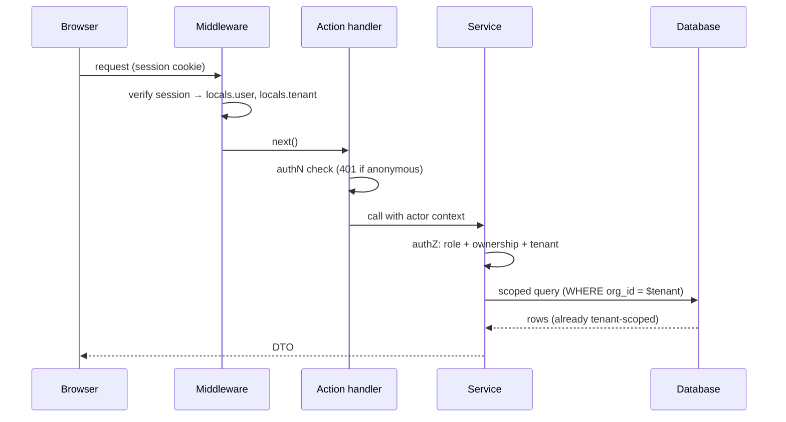

# Module 22 — Authorization & Multi-Tenancy

> Phases 17, 50, 52. Authentication says who you are. **Authorization says which rows you may touch.** Multi-tenancy is authorization with an extra dimension: the *tenant*.

## Concept: RBAC + resource ownership + tenant isolation

```text
User ──member of──► Organization (tenant) ──has──► Role (owner/admin/member/viewer)
User ──owns──► Resources (projects, invoices…)
```

Three checks, in order, on **every** privileged operation:

1. **Authenticated?** (`locals.user` exists)
2. **Role/permission?** (RBAC: `role >= 'admin'` or capability map)
3. **Ownership/tenant?** (`resource.orgId === locals.tenant.id` — **the check people forget**)

## The request flow (memorize)



## RBAC model

```ts
// src/server/permissions/index.ts
export type Role = 'viewer' | 'member' | 'admin' | 'owner';

const rank: Record<Role, number> = { viewer: 0, member: 1, admin: 2, owner: 3 };

export function can(actor: { role: Role }, action: 'read' | 'comment' | 'manage' | 'billing'): boolean {
  const need = { read: 'viewer', comment: 'member', manage: 'admin', billing: 'owner' } as const;
  return rank[actor.role] >= rank[need[action]];
}
```

Prefer **capability checks** (`can(actor, 'billing')`) over scattered `role === 'admin'` — roles evolve; capabilities are stable.

## Tenant isolation (Tenant A must never see Tenant B)

Defense layers (all of them, not either/or):

1. **Scoped queries:** every repository method takes `orgId` and filters on it.
   ```ts
   listProjects(orgId: string) {
     return db.select().from(projects).where(eq(projects.orgId, orgId));
   }
   ```
2. **Foreign keys include tenant:** `projects.org_id → organizations.id` — makes cross-tenant dangling refs impossible.
3. **Authorization in the service** before mutation: `if (project.orgId !== actor.orgId) throw new DomainError('not_found')` — return **404** (not 403) for cross-tenant IDs to avoid existence leaks.
4. **Middleware context** supplies `locals.tenant` — but services never trust "middleware must have filtered."
5. Optional: **Postgres RLS** for hard isolation on multi-tenant DBs.

**IDOR (Insecure Direct Object Reference)** is the classic failure: `GET /api/projects/123` returns the project because it exists, not because it's *yours*. Fix: ownership predicates in the data access layer.

## Static vs SSR for authenticated experiences

```text
PUBLIC SITE              (static)     landing, pricing, docs, blog
     │ links
AUTHENTICATED PORTAL     (SSR)        /app/dashboard, /app/settings, /app/billing
     │ middleware locals.user
ADMIN                    (SSR)        /admin/*, capability-checked
```

The boundary is natural in Astro: `output: 'static'` + `prerender=false` on `/app/**`, or `output: 'server'` + `prerender=true` on marketing. Unify visually via shared layouts — **not** via shared rendering mode.

## API design consequence

| Endpoint behavior | Return |
|---|---|
| anonymous on private route | `401` + redirect to login (HTML) |
| logged in, wrong role | `403` |
| logged in, right role, other tenant's ID | `404` (no existence leak) |
| owner of resource | `200` |

## Common Mistakes

**BAD:** hiding admin buttons with `user.role === 'admin' ? <AdminPanel/> : null` and calling it security.

**GOOD:** UI hints + **server enforcement** in every handler.

**BAD:** `WHERE id = $1` only — the IDOR classic.

**GOOD:** `WHERE id = $1 AND org_id = $2` (+ service-level check).

**BAD:** middleware `if (!user) redirect()` as the only protection for `/api/actions/*`.

**GOOD:** actions re-check; automated tests try direct invocation while logged out (Module 30).

**BAD:** superuser shared "admin" account for the team.

**GOOD:** individual accounts + audited admin role.

## Security Notes

- Fail closed: unknown role → lowest privilege.
- Audit logs for privileged actions (who, what, when, requestId).
- Impersonation (support tooling) = short-TTL, marked sessions (Module 21).
- Cache hazard: never serve tenant-A's cached page to tenant B — `Vary: Cookie`/`private` (Module 34).

## Performance Notes

- Scoping in SQL beats filtering in JS (and is safer).
- Permission checks are cheap maps; don't fetch roles per row — fetch actor context once per request.

## Exercises

**Beginner.** Two fake users; `/app/notes` SSR page lists only *their* notes; direct URL to another's note id → 404.

**Intermediate.** RBAC helper + admin-only `/admin/users` action that 403s members; Playwright matrix test (401/403/404/200).

**Production.** Full tenant model (orgs, memberships, invites) with scoped repository APIs + audit log table.

**Architecture Challenge.** Marketplace: vendors, buyers, platform admins, support agents who impersonate. Draw the permission matrix and the isolation guarantees.

> **Review:** capabilities per role: buyer (own orders), vendor (own products/orders-in-store), admin (all), support (impersonate with audit). Every query scoped by the *acting* tenant context; impersonation flips context explicitly and logs both identities.

**Debugging Challenge.** User A sees user B's dashboard after a "View as" feature shipped. Impersonation stored `viewingAs` in localStorage and the client trusted it. Fix: server-side impersonation sessions only; client hints cosmetic.

## MENTAL MODEL — Authorization

> Authorization is a **predicate over (actor, action, resource)** evaluated on the server, closest to the data. Roles name bundles of capabilities; ownership and tenancy are columns in your tables, checked in queries. If a check exists only in the DOM, it doesn't exist.

## Official Documentation

- Authentication guide (authz section): https://docs.astro.build/en/guides/authentication/
- Middleware: https://docs.astro.build/en/guides/middleware/
- Actions: https://docs.astro.build/en/guides/actions/
- OWASP IDOR: https://owasp.org/www-community/attacks/Insecure_Direct_Object_Reference

## What I Should Know Before Continuing

1. The three-check order on every privileged operation.
2. Why 404 instead of 403 for cross-tenant resources?
3. Give two independent layers of tenant isolation.
4. Where must authorization live so that a stolen UI is useless?
