# Reference — Request Flows & Sequence Diagrams (§81–82)

> Mermaid diagrams (GitHub renders these). Print the four flows mentally until they're instinct.

## 1. The four request flows

### Static page request

```text
Browser → CDN → (HIT) HTML bytes → paint → (islands hydrate per directive)
                → (MISS) origin file → cache → HTML bytes
```

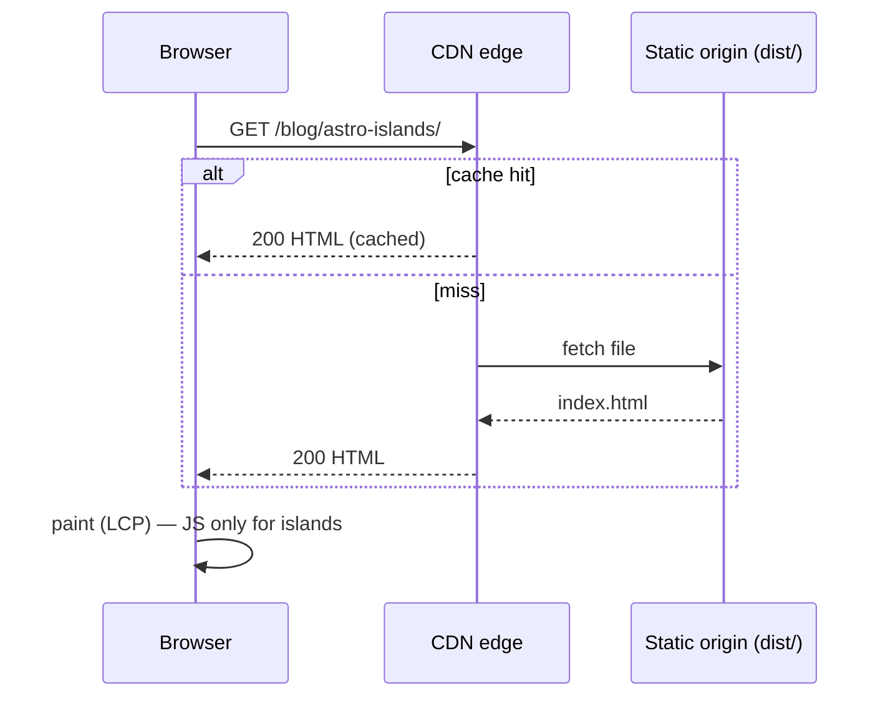

### SSR request

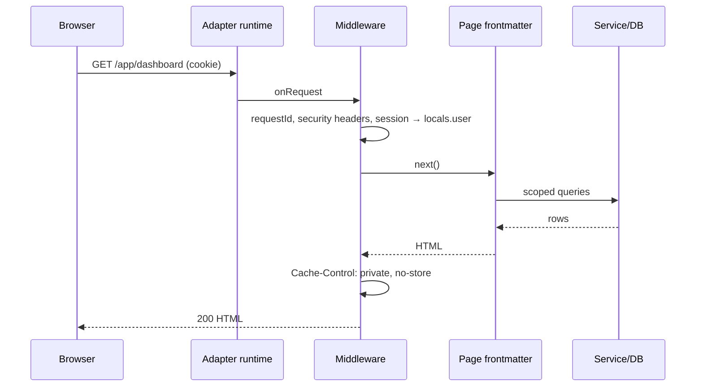

### Island hydration

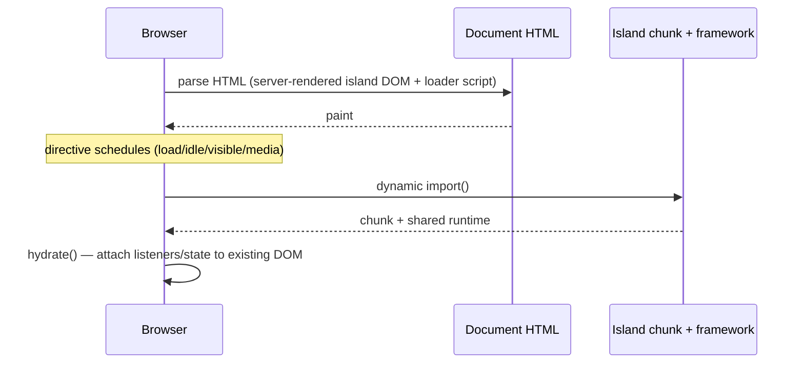

### Action invocation (form → response → UI)

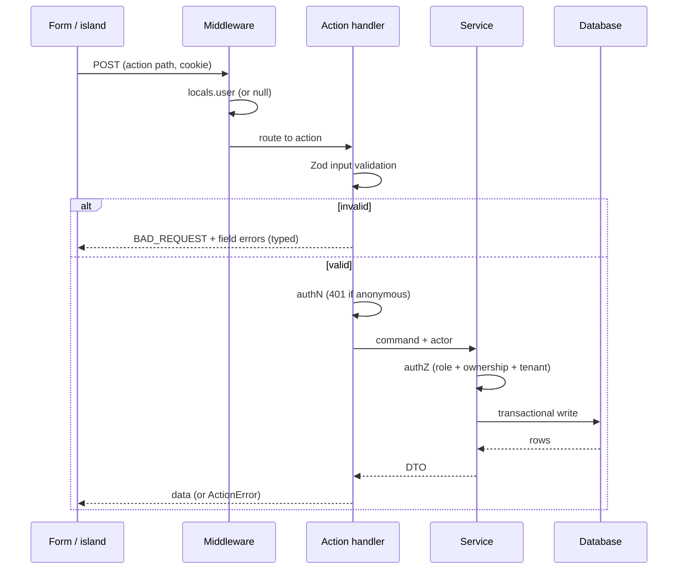

## 2. Extended sequence diagrams

### Authentication (login)

```mermaid
sequenceDiagram
  participant B as Browser
  participant E as /api/auth handler
  participant DB as Users/Sessions
  B->>E: POST email+password
  E->>DB: verify credentials (constant-time)
  alt valid
    E->>DB: create session (rotate id)
    E-->>B: Set-Cookie: session (HttpOnly; Secure; SameSite) + redirect /app
  else invalid
    E-->>B: 401 generic message
  end
```

### Logout

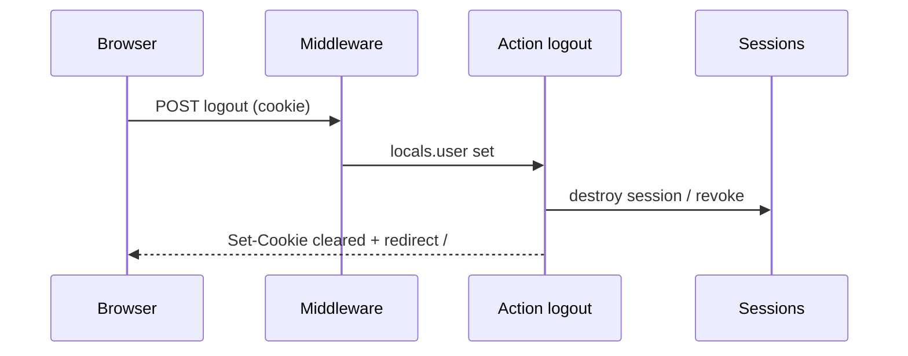

### Protected Action (createOrder)

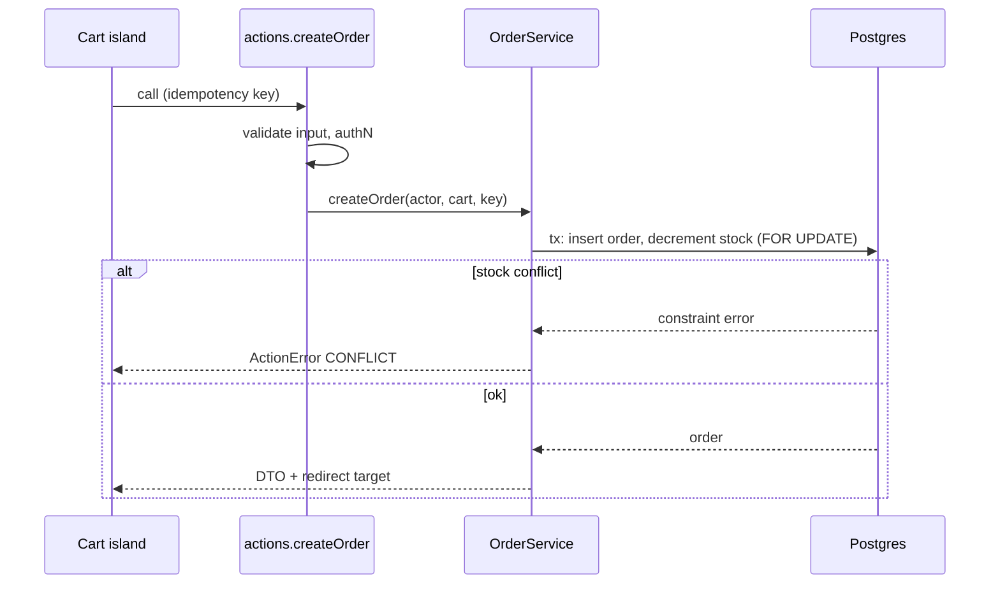

### Server endpoint (public API)

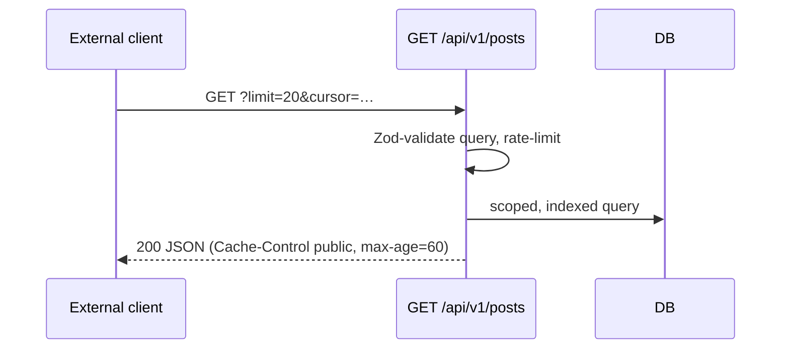

### File upload

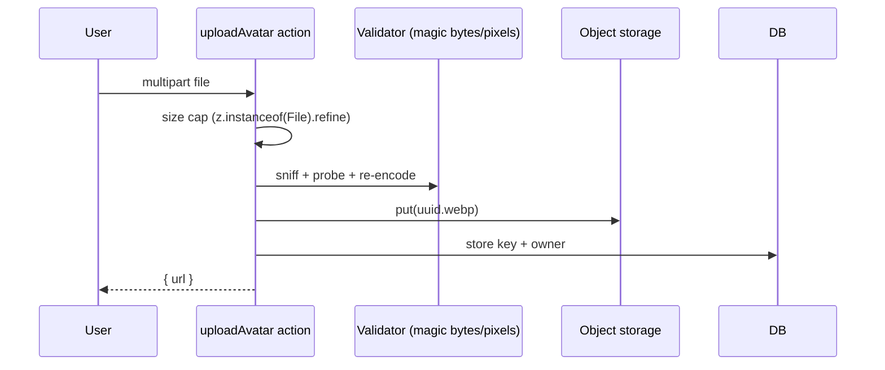

### Webhook (payments)

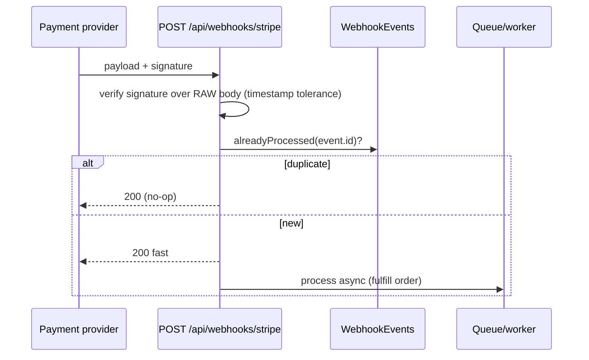

### Middleware pipeline (ordering)

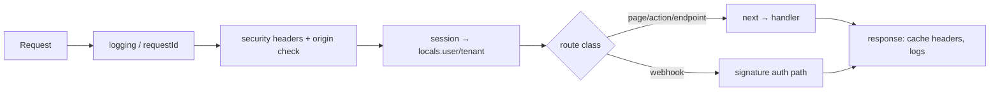

### Tenant authorization (the isolation proof)

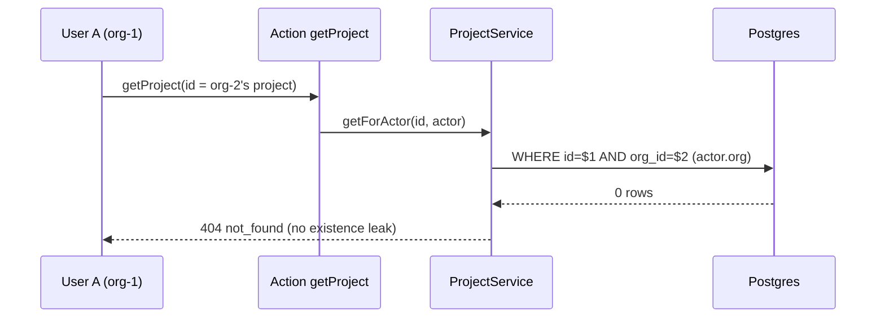

### View transition (client navigation)

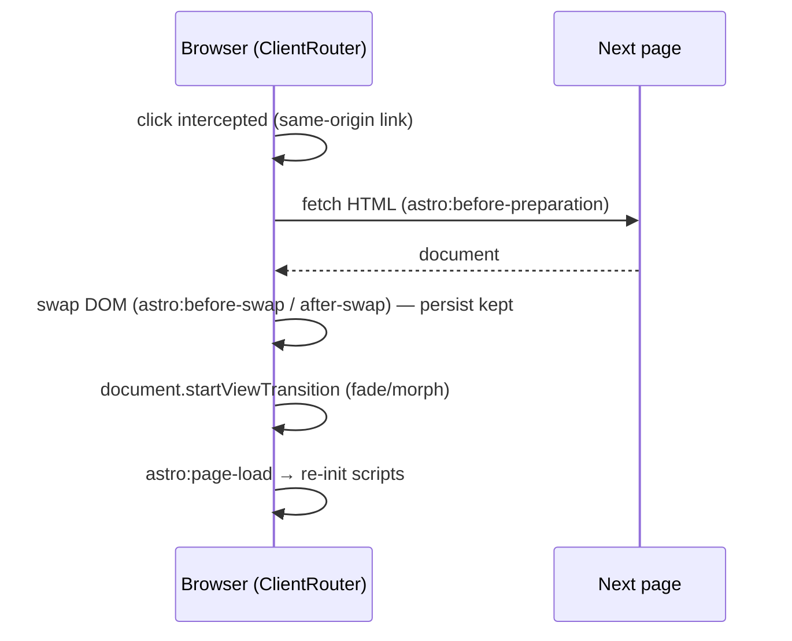

## Usage drill
Blank-page drill: redraw the Action and Tenant diagrams from memory. If you can't, re-read Modules 16 and 22.
